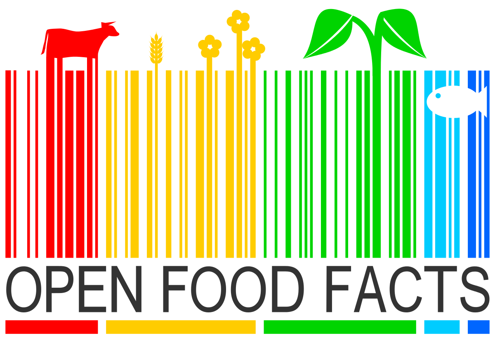
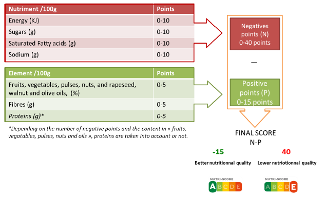

# Data-Science - Open Food Facts

## What is Open Food Facts ? 

A food products database. There are informations on ingredients, nutritional information, labels. The data comes from crowdsourcing, a data made by everyone, for everyone.

## Dataset Description 

You can find the Open Food Fact dataset here : https://world.openfoodfacts.org/data. 
It provides nutrition facts for food products sold in each country and all nutrition information we need. 
This database contains more than 100 000 records. 
It has five main fields :

- Generalities : 
  Fields related to the general information such as the name of the product, the contributor who added the product, the barcode and the url of the product.
  
- Tags : 
  Some informations related to the brands or packaging of the products. 
  
- Ingredients :
  List of ingredients of the products.
  
- Misc.:
  Extra information such as image of the product, number of food additives or ingredients from palm oil, carbon footprint (indicated on some product).
  
- Nutrition Facts : 
  The amount of a nutrient (in g or kJ for energy) for 100 g or ml of product. We also have the nutrition score defined by UK Food Standards Administration (FSA). The french nutrition score is derived from the UK FSA score and adapted for the french market.
 
## Our Goal 

We want to define the brands that sold the healthiest products. So we make a ranking based on the nutrition score.

## Copyright & License 

  Copyright 2016-2021 Open Food Facts

  Licensed under the Apache License, Version 2.0 (the "License");
  you may not use this file except in compliance with the License.
  You may obtain a copy of the License at

     https://www.apache.org/licenses/LICENSE-2.0

  Unless required by applicable law or agreed to in writing, software
  distributed under the License is distributed on an "AS IS" BASIS,
  WITHOUT WARRANTIES OR CONDITIONS OF ANY KIND, either express or implied.
  See the License for the specific language governing permissions and 
  limitations under the License.
